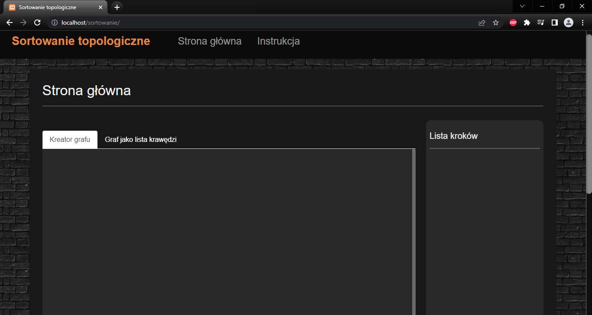
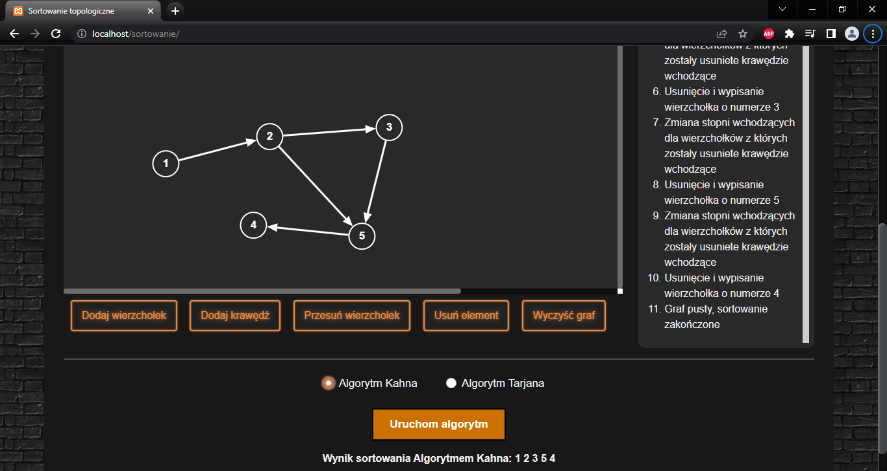

# TopologicalSortingApk

## Description of the application
An application that displays the result of sorting a topological. The user can enter the graph into the application in two ways.
The first way is a graphical generator, and the second way is to enter the graph using a list of edges. In addition to the result, the application shows what was done in order to get such a result.

## Graphic interface

 

